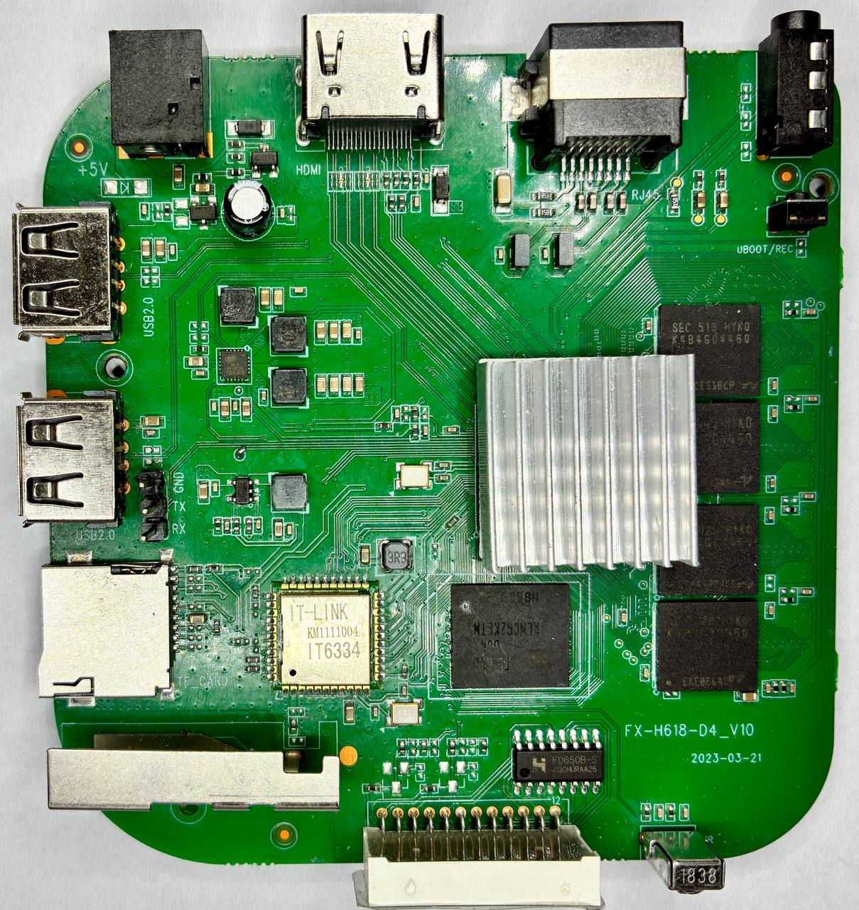
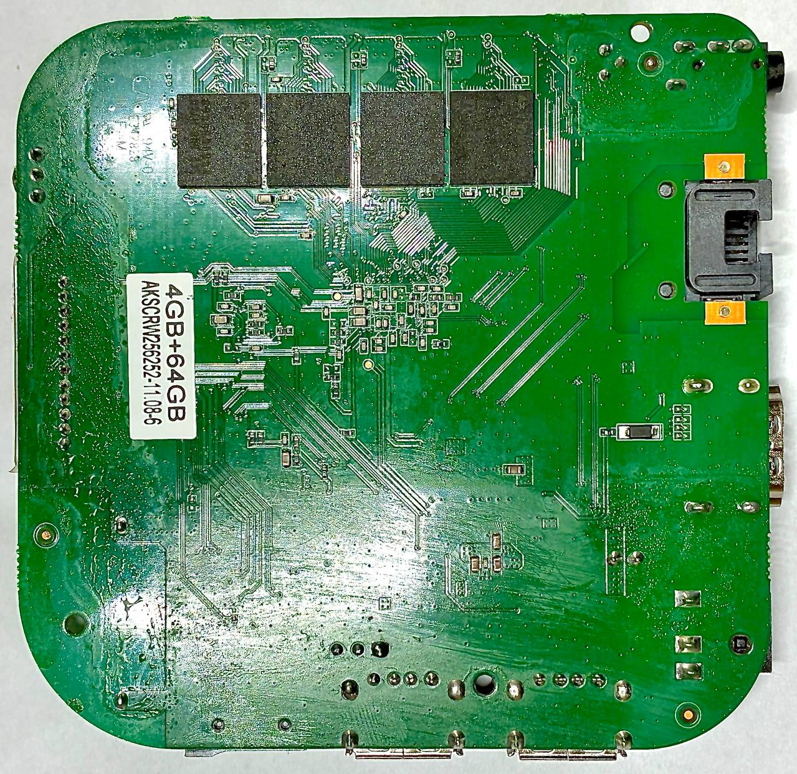

# Vontar H618 Armbian Patches

Public Armbian `userpatches` payload and host-side bring-up tools for Vontar
H618 and similar H616-class Allwinner TV boxes.

Hardware and OS bring-up is complete for the tested 4 GiB unit as of
2026-07-15. The reproducible public build path boots Armbian from microSD with
a dedicated project U-Boot/SPL instead of relying on the stock Android chain.
The final device deployment also validates Linux-default eMMC dual boot while
preserving the original Android installation.

## Board Photos

These photos document the tested board variant targeted by this payload.
See [VONTAR_H618_HARDWARE.md](userpatches/VONTAR_H618_HARDWARE.md) for full hardware details.

<table>
  <tr>
    <td align="center">
      
      <br>
      <sub>Front side</sub>
    </td>
    <td align="center">
      
      <br>
      <sub>Back side</sub>
    </td>
  </tr>
</table>

## Validated Setup

- Validated target: one 4 GiB DDR3 Vontar H618 unit
- Boot path: microSD with project U-Boot/SPL
- Kernel line: Armbian `current` and `edge`
- LAN bring-up: depends on the matching U-Boot preinit sequence in this repo
- Current U-Boot boot policy: deterministic default environment, no FAT
  `uboot.env` dependency, no UART abort window, and a minimal microSD command.
- The board explicitly selects Armbian's ARM64 `boot-sun50i-next.cmd`. It loads
  `Image` and the board DTB and maps `console=display` to `console=tty1`.
- The stock NEC infrared remote is installed automatically with a validated
  12-button Vontar keymap; no Android or Beelink keymap is required.
- The deployed eMMC layout preserves Android and provides a 30.9 GiB Linux
  root partition. A fullscreen English menu defaults to Linux after 8 seconds;
  Android is an explicit one-boot choice and its next reboot returns to Linux.
- Ethernet, Wi-Fi, Bluetooth, HDMI/display, eMMC Linux boot, Android return,
  IR navigation, console Enter, and the two-stage Power action are validated.

## Quick Start

Clone this repository next to an Armbian build checkout and link its
`userpatches/` directory into the build tree:

```bash
git clone https://github.com/aco-art/vontar-h618-armbian-patche.git
git clone https://github.com/armbian/build.git armbian-build

cd armbian-build
rm -rf userpatches
ln -s ../vontar-h618-armbian-patche/userpatches userpatches

./compile.sh BOARD=vontar-h618 BRANCH=current RELEASE=trixie \
  BUILD_DESKTOP=no BUILD_MINIMAL=yes KERNEL_CONFIGURE=no
```

`rm -rf userpatches` removes the existing `userpatches/` directory inside the
Armbian build checkout before replacing it with the symlink above.

The board configuration currently expects:

- U-Boot defconfig: `vontar_h618_zero2w_defconfig`
- Linux DTB: `allwinner/sun50i-h618-vontar-h618.dtb`
- U-Boot branch: `tag:v2025.04`
- U-Boot boot command: load `/boot/boot.scr` from microSD `mmc 0:1`

The same payload was also build-tested with `current/bookworm`, `edge/noble`,
and `edge/resolute`; see [known-status.md](docs/known-status.md) for the exact
kernel versions and hardware-validation boundary.

Board-specific Broadcom firmware payloads are included under
`userpatches/overlay/lib/firmware/brcm/`. If you redistribute this repository
or derived images, verify that the firmware licensing terms are acceptable for
your use.

## Infrared Remote

The tested stock remote uses the NEC protocol with address `0x01`. Its codes
do not match `rc-beelink-gs1`. The image customization hook installs
`ir-keytable` and `python3-evdev`, copies the dedicated `vontar-h618.toml`
table, and enables both Vontar input services. The IR service waits for `rc0`,
so minimal and desktop images get the same mapping even when the input device
appears late.

All 12 physical buttons were observed in the runtime NEC capture. The
navigation path was then verified after loading the table as real Linux input
events from `sunxi-ir`. OK is exported as `KEY_ENTER`, so it works in both the
early OS menu and a Linux console.

Power is deliberately two-stage on a text VT. The physical key is exported as
the private trigger `KEY_PROG1`; `vontar-h618-power-key.service` clears the
active shell line and types `poweroff` without Enter. Pressing OK/Enter then
executes it. In a graphical VT the helper emits a standard virtual
`KEY_POWER`, leaving the action to the desktop. Detection failures are
fail-safe and never call poweroff automatically.

To inspect the active mapping and service after boot:

```bash
systemctl status vontar-h618-ir.service
systemctl status vontar-h618-power-key.service
ir-keytable -s rc0 -r
```

| Remote button | NEC scancode | Linux key |
| --- | --- | --- |
| Right | `0x150` | `KEY_RIGHT` |
| Left | `0x151` | `KEY_LEFT` |
| Up | `0x116` | `KEY_UP` |
| Down | `0x11a` | `KEY_DOWN` |
| OK | `0x113` | `KEY_ENTER` |
| Back | `0x119` | `KEY_BACK` |
| Home | `0x111` | `KEY_HOME` |
| Menu | `0x14c` | `KEY_MENU` |
| Mouse/context | `0x100` | `KEY_CONTEXT_MENU` |
| Volume up | `0x118` | `KEY_VOLUMEUP` |
| Volume down | `0x110` | `KEY_VOLUMEDOWN` |
| Power | `0x140` | `KEY_PROG1` handled contextually |

## Current Boot Notes

- Armbian sunxi sets `BOOTDELAY=1` by default, which allows UART noise to abort
  autoboot and drop to the U-Boot prompt before `bootcmd` runs.
- The Vontar board hook overrides that to `BOOTDELAY=-2`; U-Boot then runs
  `bootcmd` without checking for abort input.
- The board defconfig uses `CONFIG_ENV_IS_NOWHERE=y` and disables FAT env, so
  the build uses the compiled default environment and lets Armbian's
  `/boot/boot.scr` read `/boot/armbianEnv.txt`.
- The minimal boot command sets `devtype`, `devnum`, and `prefix`, then sources
  Armbian's generated `/boot/boot.scr` from `mmc 0:1`.
- The board override is copied from maintained `boot-sun50i-next.cmd` and only
  separates its console mapping. Production `display` excludes `ttyS0`; debug
  `both` still enables it.

## Repository Layout

- `userpatches/` contains the board definition, U-Boot patches, kernel patches,
  optional overlay examples, and image customization hook.
- `tools/tvbox/` contains host-side diagnostics for LAN, UART, Android ADB, and
  guarded U-Boot serial workflows.
- `docs/` contains project notes about current bring-up status and publication
  boundaries.
- Local tool runs write logs under `logs/` by default, but that runtime output
  is intentionally not tracked in git.

## Diagnostics

Copy `.env.example` to `.env` or export the same variables in your shell before
using the host-side tools:

```bash
cp .env.example .env
set -a
. ./.env
set +a
tools/tvbox/tvbox-remote.sh all all
```

The remote workflow expects `sshpass` or `expect` on the host. The Windows
`com6-*` helpers require WSL with `powershell.exe` and a Windows COM port.

## Included Payload

- Armbian board file: `userpatches/config/boards/vontar-h618.tvb`
- Kernel DTS patches: `userpatches/kernel/vontar-h618/`
- U-Boot bring-up patches: `userpatches/u-boot/v2025-sunxi/board_vontar-h618/`
- Restored H618 LAN driver: `userpatches/kernel/vontar-h618/0004-driver-allwinner-h618-emac-restore-sunxi-gmac.patch`
- Optional manual MAC override: `userpatches/overlay/etc/modprobe.d/sunxi_gmac.conf`
  (normally unnecessary because `sunxi-gmac` derives a stable address from SID)
- Board-specific Broadcom firmware payloads: `userpatches/overlay/lib/firmware/brcm/`
- Stock remote keymap and services: `userpatches/overlay/etc/rc_keymaps/` and
  `userpatches/overlay/etc/systemd/system/`
- Hardware profile: `userpatches/VONTAR_H618_HARDWARE.md`

## Status

There is no active hardware or OS bring-up blocker for the photographed and
tested 4 GiB board. Further work is limited to verified regressions, other
board/RAM variants, optional application deployment, or upstream preparation.
This remains a reproducible local-build patch set rather than an upstream Linux
or U-Boot submission series. See [known-status.md](docs/known-status.md) for the
validation matrix and scope boundaries.

## Constraints

- Local lab logs, build caches, output images, and other machine-specific
  artifacts are intentionally excluded.
- This repository is a reproducible bring-up baseline, not an upstream-ready
  Linux or U-Boot submission series.
- No default IPs, passwords, UUIDs, or serial port names are embedded in the
  tracked files.
